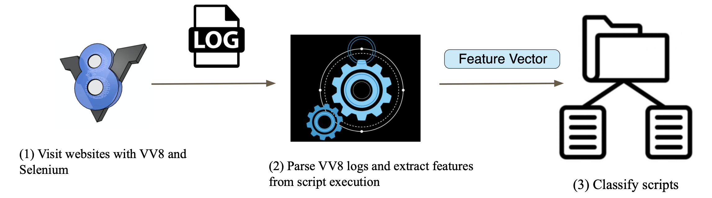

# A Machine Learning-based Approach to Detect Browser Fingerprinting

## Description
We propose a machine learning-based approach utilizing VisibleV8(VV8)[[1]](#1) to accurately detect browser fingerprinting. 
Our system outperforms the state-of-the-art with an improvement in recall of around 4.8%. 
We discover JavaScript APIs that particularly appear on fingerprinting scripts from the important features. 
It shows that our system can be used to perform a large-scale measurement to uncover more previously unreported uses of 
JavaScript APIs by stateless tracking.

## Usage
* visible\_v8logs\_crawl directory
  * crawl.py: collect script execution.
  * extract\_features.py: parse VV8 logs and convert features to a feature matrix. 
* logs directory: sample VV8 logs
* MLmodel directory
  * code directory: model evaluation, feature preparation, label construction, and dimension reduction
  * features\_v2 directory: data, feature, and labels in different rounds
  * results directory: results and performance evaluation 
  * run\_logs\_err directory: model execution logs
  * saved\_models directory:  best models

## References
<a id="1">[1]</a> 
Jueckstock, Jordan, and Alexandros Kapravelos. 
"VisibleV8: In-browser monitoring of JavaScript in the wild." Proceedings of the Internet Measurement Conference. 2019.
